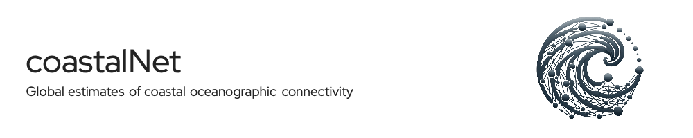
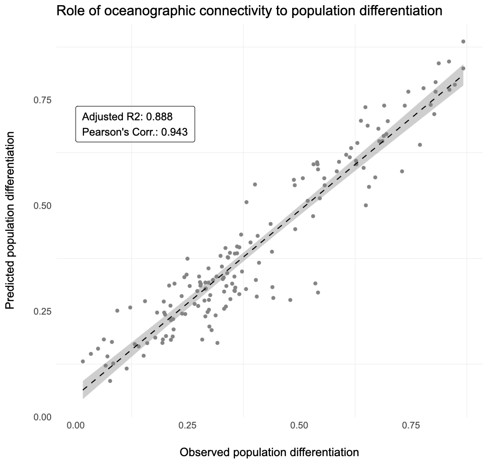
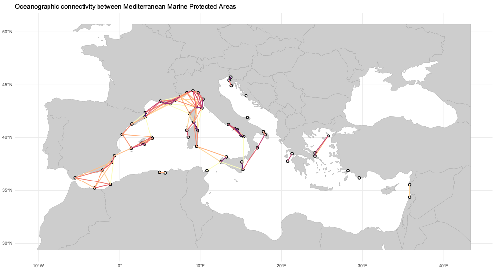

The coastalNet R package offers a suite of tools for the analysis of oceanographic connectivity and its implications for marine biodiversity. Developed to address the complex dynamics of how ocean currents influence the distribution, evolution, and conservation of marine species, coastalNet leverages high-resolution ocean current data, biophysical modeling, and graph theory to offer a comprehensive toolkit for marine ecology research.

<br>

## Description

CoastalNet aims to facilitate a deeper understanding of oceanographic connectivity by providing researchers with advanced tools for the analysis and visualization of connectivity estimates along the world's coastal areas. This R package bridges critical gaps in existing methodologies, enabling the examination of marine biodiversity distribution with an unprecedented level of detail.

The integration of biophysical modeling ([read detailed methods](vignettes/biophysicalModelling.md)) with graph theory stands at the core of coastalNet's approach. By simulating the dispersal routes of marine species and applying graph theory, coastalNet identifies critical connectivity hubs and pathways, offering realistic estimates of population connectivity. This methodological innovation allows for a nuanced understanding of marine biodiversity dynamics, challenging simplistic predictive models and unveiling the complex relationships between ocean currents and genetic structuring across marine species distributions.

<br>

## Impact on research and conservation

CoastalNet has significantly advanced the field of marine ecology by providing essential tools for the analysis of coastal ecosystems. Its contributions to science and conservation are manifold, including the enhancement of research methodologies, the provision of detailed connectivity estimates for conservation planning, and the promotion of interdisciplinary collaboration. By facilitating a more nuanced understanding of marine biodiversity and informing conservation strategies, coastalNet supports the global effort to preserve marine ecosystems in an era of rapid environmental change.

The coastalNet R package represents a significant leap forward in the study of oceanographic connectivity, offering marine ecologists a powerful tool for advancing our understanding of marine biodiversity. Its innovative approach to modeling connectivity, coupled with its commitment to open science principles, makes coastalNet a cornerstone resource for researchers and conservationists alike, driving forward the evolution of marine ecology research methodologies.

<br>

## Functions and features // REDO AFTER BETTER DETAIL FUNCTIONS

### Data retrieval
getDataBase: Downloads and loads the required database for coastal oceanographic connectivity analysis. This comprises 195,121,399 pairwise connectivity events between 26,642 coastal sites for a 180-day period.

### Spatial subsetting
getHexagonID: Identifies hexagon IDs (representing coastal sites) based on spatial objects and detail levels. It supports a variety of spatial inputs like matrices/data.frames of coordinates, numeric vectors defining bounding boxes, polygon (sf), or raster (SpatRaster) layers. It also allows for specifying a buffer distance and has a print option for visualizing hexagon sites.

### Connectivity events retrieval
getConnectivityEvents: Retrieves connectivity events from a database based on specified criteria such as hexagon IDs (from/to), time filters (year, month, day), and a period defining the timeframe of interest for connectivity events.

### Connectivity analysis
calculatePairwiseConnectivity: Calculates pairwise connectivity between hexagon sites using the retrieved connectivity events. It allows for specifying the type of connectivity (forward or backward), the value to calculate (probability or time), and options for stepping stone connectivity (including the number of stepping stones and parallel processing capabilities).

mapConnectivity: Visualizes connectivity between pairs of sites by mapping the estimates of connectivity (probability/time) and overlaying these connections on a map with the coordinates of the sites. This function generates a data frame and a polygon of class sf with line connections between pairs of sites.

<br>

## Installation

To install the coastalNet package users should utilize the remotes package in R. The remotes package provides a straightforward mechanism for installing R packages directly from GitHub repositories, which is particularly useful for accessing the latest versions of packages that may not yet be available on CRAN. To install coastalNet, you can run the following command in your R console: 

```r 
remotes::install_github("jorgeassis/coastalNet")
```

<br>

## Dependencies and Integration

The package integrates with several external R packages for spatial data manipulation (terra, sf, raster), statistical and graph analysis (FNN, igraph, data.table), parallel processing (parallel, doParallel), and visualization (ggplot2, geosphere).

<br>

## Potential applications

The applications of coastalNet's oceanographic connectivity estimates are wide-ranging and critical for advancing marine science:

#### Evolutionary dynamics
By providing detailed connectivity estimates, coastalNet enables researchers to explore the evolutionary processes shaping marine biodiversity. It offers insights into how oceanographic connectivity influences genetic differentiation across populations, aiding in the understanding of speciation and adaptation in the marine environment.

### Climate change research
CoastalNet's estimates are invaluable for projecting species' range expansions in response to changing climate conditions. This aids in anticipating shifts in marine biodiversity distribution and preparing for the ecological impacts of climate change.

### Invasive species management
The tool facilitates the mapping of potential spread routes for non-native species, highlighting areas at risk due to global shipping routes and changing environmental conditions. This is crucial for developing strategies to manage invasive species and protect native marine ecosystems.

### Fisheries management
By evaluating the connectivity among fish stocks, coastalNet assists in the development of sustainable fishing practices. It enables the determination of optimal harvesting rates and replenishment strategies, ensuring the long-term viability of economically significant fisheries.

### Conservation priorities
CoastalNet plays a pivotal role in identifying essential habitats and connectivity pathways for the protection of endangered and isolated populations. This capability is essential for setting conservation priorities and targeting efforts where they are most needed.

### Design of Marine Protected Area networks
Strategic planning based on connectivity estimates from coastalNet can enhance the effectiveness of MPA networks. By ensuring that protected areas are interconnected, these networks can support marine biodiversity conservation efforts more effectively, promoting the resilience and sustainability of marine ecosystems.

<br>

## Demonstration cases

### Case 1. The role of oceanographic connectivity in population differentiation

The provided R script is designed to estimate oceanographic connectivity between sampled populations of Laminaria ochroleuca and verify its role on population geentic differentiation.

[Demonstration case 1](vignettes/Example1.md)



*Stepping-stone oceanographic connectivity between populations*

<br>

### Case 2. Fish larvae connectivity among Mediterranean Marine Protected Areas

The provided R script is designed to analyze oceanographic connectivity of fish populations among Mediterranean Marine Protected Areas (MPAs). 

[Demonstration case 2](vignettes/Example2.md)



*Fish connectivity between Mediterranean Marine Protected Areas*

<br>

### Case 3. Impact of oceanographic connectivity on the future distribution of marine species

This script focuses on evaluating the impact of oceanographic connectivity on the future distribution of the marine species Macrocystis pyrifera under changing environmental conditions. 

[Demonstration case 3](vignettes/Example3.md)


*Future range expansions of a marine species*

<br>

## Citation

The coastalNet R is documented in on peer reviewed articles that you should cite:<br>
Anonimous for peer-review (2024) Coastal oceanographic connectivity estimates at the global scale

<br>

## License

This work is licensed under the Creative Commons Attribution 4.0 International License. To view a copy of this license, visit http://creativecommons.org/licenses/by/4.0/.

<br>

## Acknowledgments

Logo: DALL.E<br>
Github Header: https://leviarista.github.io/github-profile-header-generator/
