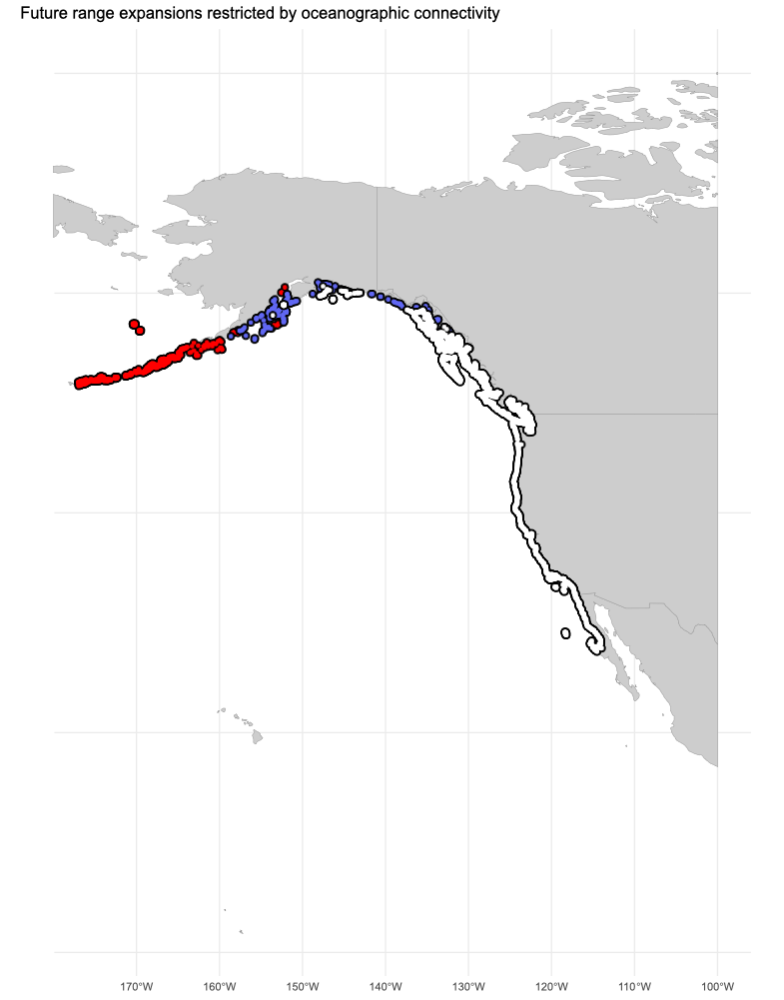

# coastalNet

### Global estimates of coastal oceanographic connectivity.

The R package coastalNet offers a suite of tools for retrieving, analyzing and visualizing coastal oceanographic connectivity estimated with high-resolution biophysical modelling.

<br>

## Introduction

Oceanographic connectivity driven by ocean currents plays a crucial role in shaping the distribution of marine biodiversity, from genes to ecosystems. It mediated gene and individual exchanges between marine populations, especially during pelagic dispersal stages, significantly influencing population dynamics, regional genetic diversity and differentiation, and ultimately, population persistence over time.

The examination of oceanographic connectivity has been precluded by over simplistic methods, such as isolation by distance models that assume higher population isolation with increasing geographic distances, or illustrative maps from which population connectivity is inferred from the general patterns ocean current. These methods overlook the role of tidal forces, topographic features, and wind on oceanic movements, which result in asymmetric connectivity flows among populations, with significant variations across both space and time. Additionally, the link between ocean currents and population connectivity is not linear but rather skewed, matching the extensive genetic structure observed among marine species' distributions.

Biophysical modeling and Lagrangian simulations have significantly advanced our understanding of oceanographic connectivity, providing more accurate estimates of population connectivity by simulating dispersal patterns of larvae and propagules transported by ocean currents.

The coastalNet R package emerges as a pivotal tool in marine research and conservation by resolving coastal oceanographic connectivity inferred from a biophysical model that run globally for a two-decade period. Its applications are diverse, including (1) testing the role of oceanographic connectivity in the extant levels of population genetic differentiation, (2) the identification key areas for the conservation of endangered and isolated populations and (3) the strategic designation of coherent networks of marine protected areas. For fisheries, it can (4) provide ways to develop sustainable practices by analyzing the connectivity of important fish populations. The tool is equally crucial for evaluating the effect of climate change on marine connectivity, as it can (5) estimate the direction and intensity of future range expansions while populations track habitat suitability. 

These applications highlight the importance of coastalNet in enhancing our understanding and management of marine environments, establishing it as a vital tool for both researchers and conservation practitioners.

<br>

## Functions and features

### Data Retrieval
getDataBase: Downloads and loads the required database for coastal oceanographic connectivity analysis. This comprises 195,121,399 pairwise connectivity events between 26,642 coastal sites for a 180-day period.

### Spatial subsetting
getHexagonID: Identifies hexagon IDs (representing coastal sites) based on spatial objects and detail levels. It supports a variety of spatial inputs like matrices/data.frames of coordinates, numeric vectors defining bounding boxes, polygon (sf), or raster (SpatRaster) layers. It also allows for specifying a buffer distance and has a print option for visualizing hexagon sites.

### Connectivity Events Retrieval
getConnectivityEvents: Retrieves connectivity events from a database based on specified criteria such as hexagon IDs (from/to), time filters (year, month, day), and a period defining the timeframe of interest for connectivity events.

### Connectivity Analysis
calculatePairwiseConnectivity: Calculates pairwise connectivity between hexagon sites using the retrieved connectivity events. It allows for specifying the type of connectivity (forward or backward), the value to calculate (probability or time), and options for stepping stone connectivity (including the number of stepping stones and parallel processing capabilities).

mapConnectivity: Visualizes connectivity between pairs of sites by mapping the estimates of connectivity (probability/time) and overlaying these connections on a map with the coordinates of the sites. This function generates a data frame and a polygon of class sf with line connections between pairs of sites.

<br>

## Installation

To install the coastalNet package users should utilize the remotes package in R. The remotes package provides a straightforward mechanism for installing R packages directly from GitHub repositories, which is particularly useful for accessing the latest versions of packages that may not yet be available on CRAN. To install coastalNet, you can run the following command in your R console: 

```r 
remotes::install_github("jorgeassis/coastalNet")
```

<br>

## Demonstration cases

### Case 1. The role of oceanographic connectivity in population differentiation

The provided R script is designed to estimate oceanographic connectivity between sampled populations of Laminaria ochroleuca and verify its role on population geentic differentiation.

[Demonstration case 1](vignettes/Example1.md)


*Stepping-stone oceanographic connectivity between populations*

<br>

### Case 2. Fish larvae connectivity among Mediterranean Marine Protected Areas

The provided R script is designed to analyze oceanographic connectivity of fish populations among Mediterranean Marine Protected Areas (MPAs). 

[Demonstration case 2](vignettes/Example2.md)


*Fish connectivity between Mediterranean Marine Protected Areas*

<br>

### Case 3. Impact of oceanographic connectivity on the future distribution of marine species

This script focuses on evaluating the impact of oceanographic connectivity on the future distribution of the marine species Macrocystis pyrifera under changing environmental conditions. 

[Demonstration case 3](vignettes/Example3.md)



*Future range expansions of a marine species*

<br>

## Dependencies and Integration

The package integrates with several external R packages for spatial data manipulation (terra, sf, raster), statistical and graph analysis (FNN, igraph, data.table), parallel processing (parallel, doParallel), and visualization (ggplot2, geosphere).


