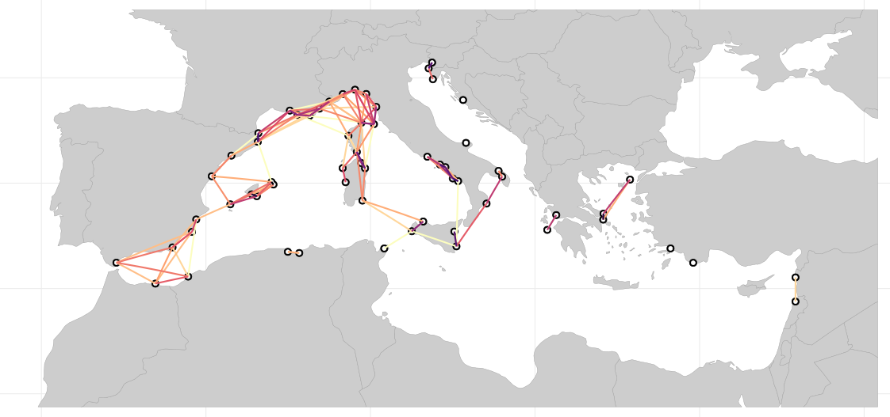
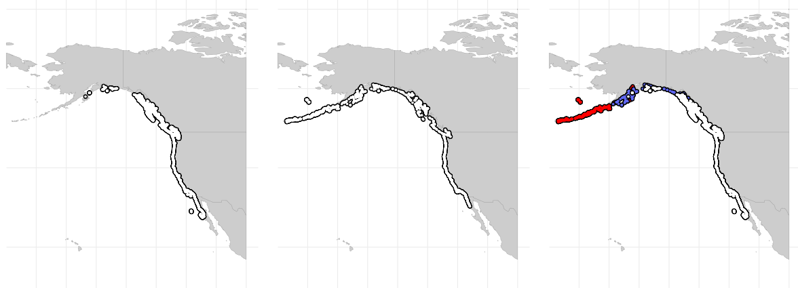

The coastalNet R package offers a suite of tools for the analysis of oceanographic connectivity. Developed to address the complex dynamics of how ocean currents influence the distribution, evolution, and conservation of marine species, coastalNet leverages high-resolution ocean current data, biophysical modeling, and graph theory to offer a comprehensive toolkit for marine ecology research.

<br>

## Features and functions

### Data retrieval
getDataBase: Downloads and prepares the oceanographic connectivity database. This extensive database contains over 195 million connectivity events between more than 26,000 coastal sites, providing a detailed picture of potential connections over a 180-day period.

### Spatial subsetting
getHexagonID: This versatile function pinpoints the hexagons in your database that represent coastal locations of interest. It works with various input types (coordinates, bounding boxes, polygons, or raster maps), lets you add a buffer around your area of interest, and provides an option to visually confirm the selected hexagons.

### Connectivity events retrieval
getConnectivityEvents: Filters the vast connectivity database to extract precisely the events you need. Specify the hexagons involved (where connections start and end), the timeframe (year, month, day), and the duration of events that are relevant to your analysis.

### Connectivity analysis
calculatePairwiseConnectivity: Calculates different types of connectivity measures between pairs of coastal hexagons. This function determines "forward" or "backward" connectivity, calculates probability or time-based metrics, and even handles indirect connections with its stepping-stone analysis options (including the ability to use multiple computer cores for faster calculations).

### Map connectivity
mapConnectivity: Visualizes the results of your connectivity analysis. It displays connections between sites on a map, showing connectivity strength (probability or time), and provides the underlying data for further use.

<br>

## Installation

To install coastalNet, you can run the following command in your R console: 

```r 
# If you haven't installed remotes yet, do so:
install.packages("remotes")

# Install coastalNet
remotes::install_github("jorgeassis/coastalNet")
```

<br>

## Dependencies and Integration

The package integrates with several external R packages for spatial data manipulation (terra, sf, raster), statistical and graph analysis (FNN, igraph, data.table), parallel processing (parallel, doParallel), and visualization (ggplot2, geosphere).

<br>

## Potential applications

The applications of coastalNet's oceanographic connectivity estimates are wide-ranging and critical for advancing marine science:

### Evolutionary dynamics
By providing detailed connectivity estimates, coastalNet enables researchers to explore the evolutionary processes shaping marine biodiversity. It offers insights into how oceanographic connectivity influences genetic differentiation across populations, aiding in the understanding of speciation and adaptation in the marine environment.

### Climate change research
CoastalNet's estimates are invaluable for projecting species' range expansions in response to changing climate conditions. This aids in anticipating shifts in marine biodiversity distribution and preparing for the ecological impacts of climate change.

### Invasive species management
The tool facilitates the mapping of potential spread routes for non-native species, highlighting areas at risk due to global shipping routes and changing environmental conditions. This is crucial for developing strategies to manage invasive species and protect native marine ecosystems.

### Fisheries management
By evaluating the connectivity among fish stocks, coastalNet assists in the development of sustainable fishing practices. It enables the determination of optimal harvesting rates and replenishment strategies, ensuring the long-term viability of economically significant fisheries.

### Conservation priorities
CoastalNet plays a pivotal role in identifying essential habitats and connectivity pathways for the protection of endangered and isolated populations. This capability is essential for setting conservation priorities and targeting efforts where they are most needed.

### Design of Marine Protected Area networks
Strategic planning based on connectivity estimates from coastalNet can enhance the effectiveness of MPA networks. By ensuring that protected areas are interconnected, these networks can support marine biodiversity conservation efforts more effectively, promoting the resilience and sustainability of marine ecosystems.

<br>

## Demonstration cases

To illustrate the diverse applications of the dataset, we provide three examples using coastalNet package, drawn from previously published research that utilized the underlying biophysical model. 

### The role of oceanographic connectivity in population differentiation

The first study investigated to what extent oceanographic connectivity explains population genetic differentiation of a kelp species (Laminaria ochroleuca). The provided example code builds a statistical regression model between oceanographic connectivity and empirical genetic differentiation data using 15 polymorphic microsatellite markers for 23 populations across the species entire distribution. The regression model explained approximately 65% of the observed genetic variation. The code also allows generating maps of stepping-stone connectivity pathways between kelp populations.

[R code for case 1](vignettes/Example1.md)

Reference: Assis, J., Serrão, E. A., C. Coelho, N., Tempera, F., Valero, M., & Alberto, F. (2018). Past climate changes and strong oceanographic barriers structured low ‐ latitude genetic relics for the golden kelp Laminaria ochroleuca. Journal of Biogeography, 45(45), 2326–2336. https://doi.org/10.1111/jbi.13425

*Stepping-stone oceanographic connectivity between populations*

<br>

### Case 2. Fish larvae connectivity among Mediterranean Marine Protected Areas

The second study 19 mapped oceanographic connectivity withing a network of Mediterranean MPAs. The provided example code (Supplement 2) estimates connectivity (using a typical larvae duration of 32 days7,15) between spatial polygons representing the shape and distribution of no-take MPAs (Figure 3b). The approach reveals extensive connectivity among MPAs in the western Mediterranean Sea, but a lack of sufficient stepping-stone connectivity between MPAs in the eastern Mediterranean.

[Demonstration case 2](vignettes/Example2.pdf)



*Fish connectivity between Mediterranean Marine Protected Areas*

<br>

### Case 3. Impact of oceanographic connectivity on the future distribution of marine species

The third study 36 explored how oceanographic connectivity may restrict a kelp species (Macrocystis pyrifera) to track suitable habitats under future climate change. The provided example code (Supplement 3) combines oceanographic connectivity with habitat suitability data for present and future conditions 37. The approach reveals extensive areas projected to become suitable habitats in the future but likely to remain inaccessible to the kelp due to dispersal barriers created by ocean currents (Figure 3c).

[Demonstration case 3](vignettes/Example3.pdf)



*Future range expansions of a marine species*

<br>

## Citation

The coastalNet R is documented in on peer reviewed articles that you should cite:<br>
Anonimous for peer-review (2024) Coastal oceanographic connectivity estimates at the global scale.

<br>

## License

This work is licensed under the Creative Commons Attribution 4.0 International License. To view a copy of this license, visit http://creativecommons.org/licenses/by/4.0/.

<br>

## Acknowledgments

Logo: DALL.E<br>
Github Header: https://leviarista.github.io/github-profile-header-generator/
