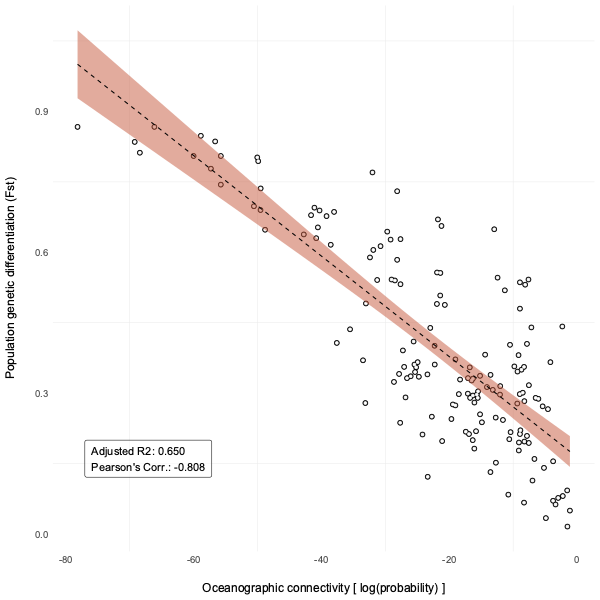
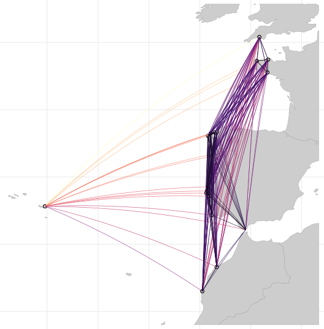

## The role of oceanographic connectivity in population differentiation

Oceanographic connectivity driven by the direction and intensity of ocean currents can shape the distribution of intraspecific biodiversity (i.e., the genetic differentiation levels). This code explores how oceanographic connectivity influences population genetic differentiation in a kelp species (Laminaria ochroleuca). It starts by loading data on 23 kelp sampling locations and their pairwise genetic differentiation levels inferred using 15 polymorphic microsatellite markers. It calculates pairwise connectivity probabilities between sampling sites, considering multigenerational stepping-stone connections. Then, it builds a statistical model to test if higher connectivity is linked to lower genetic differentiation among kelp populations. The code visualizes this relationship with a scatterplot and creates a map to show the connections between sampling sites, with thicker lines indicating stronger connectivity.

By combining oceanographic connectivity information derived from coastalNet package with empirical genetic data, the code demonstrates that intraspecific biodiversity can be highly structured by connectivity driven by oceanographic transport and barriers.

Reference: Assis, J., Serrão, E. A., C. Coelho, N., Tempera, F., Valero, M., & Alberto, F. (2018). Past climate changes and strong oceanographic barriers structured low ‐ latitude genetic relics for the golden kelp Laminaria ochroleuca. Journal of Biogeography, 45(45), 2326–2336. https://doi.org/10.1111/jbi.13425

### Environment Preparation and Package Loading

Cleans the R environment and forces garbage collection to ensure a clean workspace.
Loads necessary R packages for the analysis, which include coastalNet package.

```r
# Clean environment and load packages
rm(list = ls())
gc(reset=TRUE)
library(coastalNet)
library(ggplot2)
library(sf)
library(lme4)
library(rnaturalearth)
library(viridis)
```

### Data Loading

Imports two CSV files from repository:

laminariaRecords: Contains geographical coordinates (longitude and latitude, WGS84) of sampled sites for Laminaria ochroleuca.
laminariaPopDifferentiation: Contains pairwise genetic differentiation estimates between the sampled sites.

```r
# Download files from repository
download.file("https://figshare.com/ndownloader/files/47592263", "Laminaria-ochroleuca-Coords.csv", quiet = TRUE, mode = "wb")
download.file("https://figshare.com/ndownloader/files/47592254", "Laminaria-ochroleuca-JostD.csv", quiet = TRUE, mode = "wb")

# Load data.frame containing coordinates (as longitude and longitude, WGS84) of sites sampled for the marine species Laminaria ochroleuca.
laminariaRecords <- read.csv("Laminaria-ochroleuca-Coords.csv", sep=";", header = TRUE)

# Load data.frame containing pairwise genetic differentiation estimates between coordinate sites
laminariaPopDifferentiation <- read.csv("Laminaria-ochroleuca-JostD.csv", sep=";", header = FALSE)
```

### Connectivity Analysis

Loads the database of connectivity events (downloads also if not already present).
Determines hexagon IDs defining the study region based on the extent of the sampled sites, with a specified buffer.
Calculates connectivity events within the study region for a specified period, considering all years, months, and days.
Obtains pairwise connectivity estimates between the sampled sites using a forward connectivity type, considering the probability of connectivity and allowing for stepping-stone connections.

```r
# Load database
oceanographicConnectivity <- getDataBase(myFolder="Database", overwrite=FALSE)

# Get hexagon IDs that define the study region
hexagonIDRegion <- getHexagonID(obj=laminariaRecords, level="extent", buffer=5, print=TRUE)
```


```r
# Get connectivity events for the study region (all years, all months, all days, 120 days period)
connectivityEvents <- getConnectivityEvents(connectivity=oceanographicConnectivity,hexagonID=hexagonIDRegion, period=120 )

# Get hexagon IDs of the sampling sites
hexagonIDSites <- getHexagonID(obj=laminariaRecords, level="site", buffer=0, print=FALSE)

# Get pairwise connectivity estimates between coordinate sites
pairwiseConnectivity <- getPairwiseConnectivity(connectivityEvents, hexagonIDFrom=hexagonIDSites, connType="Forward", value="Probability", steppingStone=TRUE)
```

### Data Preparation for Modeling

Constructs a data frame to match pairs of oceanographic connectivity with pairs of population differentiation for all site pairs, excluding self-comparisons. Cleans the data frame by removing zero connectivity values and missing data, and applies a negative log transformation to the connectivity values.

```r
# Produce and data.frame matching pairs of oceanographic connectivity and pairs of population differentiation 
modelDataFrame <- data.frame()
for( from in 1:nrow(laminariaRecords)) {
  for( to in 1:nrow(laminariaRecords)) {
    if( from == to ) { next }
    modelDataFrame <- rbind(modelDataFrame,data.frame(from = from, to = to, connectivity = mean(pairwiseConnectivity$connectivityMatrix[from,to], pairwiseConnectivity$connectivityMatrix[to,from], na.rm=T), differentiation = as.numeric(laminariaPopDifferentiation[from,to])))
  }
}

# Remove zero connectivity values, missing values and Log-transform connectivity
modelDataFrame <- modelDataFrame[modelDataFrame$connectivity != 0 ,]
modelDataFrame <- modelDataFrame[complete.cases(modelDataFrame),]
modelDataFrame$connectivity <- log(modelDataFrame$connectivity)
```

### Statistical Modeling

Fits a linear model to examine the relationship between oceanographic connectivity and population differentiation.<br>
Calculates the adjusted R-squared value and Pearson's correlation coefficient to access the relationship.

```r
# Model oceanographic connectivity to population differentiation
model <- lm(connectivity ~ differentiation, data = modelDataFrame)
r2 <- summary(model)$adj.r.squared
Pearson <- cor(modelDataFrame$connectivity, modelDataFrame$differentiation)
```

### Visualization

Produces two plots:

A scatter plot showing Oceanographic connectivity [ log(probability) ] versus Population genetic differentiation (Fst), including a regression line, and displaying the adjusted R-squared and Pearson's correlation coefficient.
A map visualizing the stepping-stone oceanographic connectivity between populations, overlaying the sampled sites on a world map and depicting connectivity paths.

```r
ggplot() + 
  geom_point(data = modelDataFrame, aes(x=connectivity, y=differentiation), color="#000000", fill="#000000", size=2 ) + 
  geom_point(data = modelDataFrame, aes(x=connectivity, y=differentiation), color="white", fill="white", size=1 ) + 
  geom_smooth(data = modelDataFrame, method=lm, aes(x=connectivity, y=differentiation), linetype = "dashed", fill="#c5593c", col='black', size=0.5, alpha = 0.5) + 
  xlab(paste0("Oceanographic connectivity [ log(probability) ]")) + ylab("Population genetic differentiation (Fst)") +
  theme_minimal() + 
  theme( panel.grid.major = element_blank() ,
         text = element_text(size=12) ,
         axis.title.y = element_text(margin = margin(t = 0, r = 18, b = 0, l = 0)) ,
         axis.title.x = element_text(margin = margin(t = 18, r = 0, b = 0, l = 0)) ,
         legend.title = element_blank()) +
         annotate("label", alpha = 0.5, label.padding=unit(0.5, "lines"), x = -77, y = 0.2, hjust=0,vjust=1 , label = paste0("Adjusted R2: ", format(round(r2, 3), nsmall = 3),"\nPearson's Corr.: ",format(round(Pearson, 3), nsmall = 3)))
```



```r
# Map oceanographic connectivity between populations
mappedConnectivity <- mapConnectivity(connectivityPairs=pairwiseConnectivity$connectivityPairs)

# Load the worldmap and crop to the atudy region
worldMap <- ne_countries(scale = "medium", returnclass = "sf")
worldMap <- st_crop(worldMap,mappedConnectivity$lineConnections)

# Get hexagon IDs that retrieved oceanographic connectivity estimates
hexagonIDConnected <- unique(c(mappedConnectivity$mappingData$FromHexagon,mappedConnectivity$mappingData$FromHexagon))

# Get a data.frame of the location of hexagons that retrieved oceanographic connectivity estimates
data("hexagonCells")
hexagonCellsConnected <- hexagonCells[hexagonCells$ID %in% hexagonIDConnected,1]
hexagonCellsConnected <- st_coordinates(st_centroid(hexagonCellsConnected))

# Make a plot of the oceanographic connectivity between populations
ggplot() + 
  geom_sf(data = worldMap , fill="#CDCDCD", colour = "#9E9E9E" , size=0.25) +
  geom_point(data = hexagonCellsConnected, aes(x = X, y = Y), colour = "#000000",size=2.5) +
  geom_point(data = hexagonCellsConnected, aes(x = X, y = Y), colour = "#FFFFFF",size=1.25) +
  geom_sf(data = mappedConnectivity$lineConnections , linewidth = 0.35 , aes(colour = Value), alpha=0.75) +
  scale_color_gradientn(colours=rev(magma(6)),na.value = NA, trans = "log") +
  theme_minimal() + theme(axis.title.x=element_blank(),
                          axis.ticks.x=element_blank(),
                          axis.title.y=element_blank(),
                          axis.ticks.y=element_blank(), legend.position = "none") +
  coord_sf()
```

