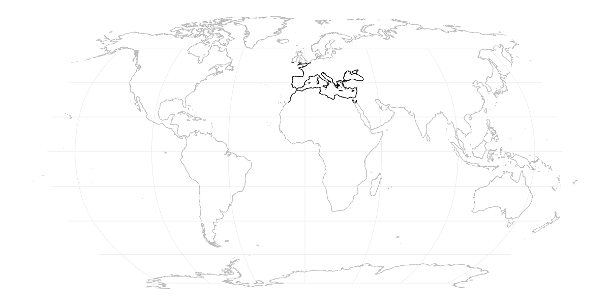
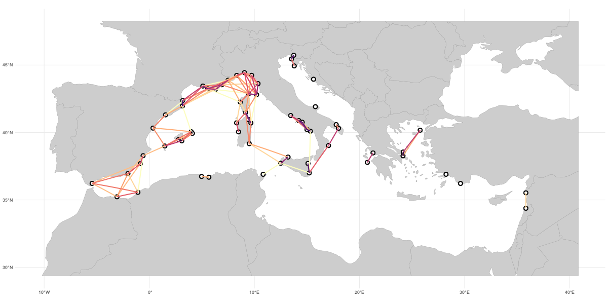

Networks of Marine Protected Areas (MPAs) must ensure sufficient stepping-stone connectivity for proper conservation of regional pools of biodiversity in the long-term. For marine biodiversity, connectivity between populations is mostly mediated by passively dispersed stages (e.g., larvae and propagules), which have contrasting dispersal capacity, from a couple hours to hundreds of days.

This code example focuses on mapping oceanographic connectivity patterns within a network of European Marine Protected Areas (MPAs). 

It begins by loading a map of MPA locations and retrieving oceanographic connectivity data from your coastalNet database for the associated region. The code then identifies hexagons encompassing the MPAs and calculates pairwise connectivity probabilities between them, focusing on direct connections of fish populations (average propagule duration of 32 days). Finally, it creates a map visualization highlighting the network of connections between MPAs. The connections are represented by lines, with thicker lines signifying stronger oceanographic connectivity.

By combining oceanographic connectivity information derived from coastalNet package with the distribution of MPAs and larvae duration periods, this script provides an overall view of how fish populations are connected across the Mediterranean MPAs.

Here's a summary of the key steps and functionalities encapsulated in the code:

### Environment Preparation and Package Loading

Cleans the R environment and forces garbage collection to ensure a clean workspace. Loads necessary R packages for the analysis, which include coastalNet package.

```r 
# Clean environment and load packages
rm(list = ls())
gc(reset=TRUE)

library(coastalNet)

library(ggplot2)
library(rnaturalearth)
library(viridis)
library(sf)
sf_use_s2(FALSE)
```

### Data Loading

A polygon of class sf representing locations of Mediterranean MPAs is loaded from an online repository. This polygon is then transformed into a data.frame of centroid coordinates, simplifying the spatial data for further analysis.

```r 
# Load a polygon of class sf containing locations (WGS84) of Mediterranean Marine Protected Areas.
europeanMPA <- loadRData("https://raw.githubusercontent.com/jorgeassis/coastalNet/main/vignettes/data/MPAEurope.RData")

```

### Connectivity Analysis

Initializes a local database for storing analysis results (if not already present). Determines hexagon IDs defining the study region based on the extent of the sampled sites, with a specified buffer. Calculates connectivity events within the study region for a specified period (32 days, the mean larvae duration of fish), considering all years, months, and days. Obtains pairwise connectivity estimates between the precise locations of the MPAs.

```r 
# Load database
getDataBase(myFolder="Database", overwrite=FALSE)

# Get hexagon IDs that define the study region
hexagonIDRegion <- getHexagonID(obj=europeanMPA, level="extent", buffer=6, print=TRUE)
```



```r 
# Get connectivity events for the study region (all years, all months, all days, 32 days period)
connectivityEvents <- getConnectivityEvents(hexagonID=hexagonIDRegion, period=32 )

# Get hexagon IDs of the sampling sites
hexagonIDSites <- getHexagonID(obj=europeanMPA, level="site", buffer=0, print=FALSE)

# Get pairwise connectivity estimates between coordinate sites
pairwiseConnectivity <- getPairwiseConnectivity(connectivityEvents, hexagonIDFrom=hexagonIDSites, connType="Forward", value="Probability", steppingStone=FALSE)
```

### Mapping Connectivity

A comprehensive visualization of oceanographic connectivity between MPAs is generated, illustrating the connections on a map. This visualization includes: A base map of the world, cropped to the study region, serving as a geographical context. Points representing the MPAs, enhancing the map's informational value by highlighting the exact locations of interest. Line connections between pairs of sites, colored according to the probability or strength of connectivity, providing a clear visual representation of potential ecological links across the marine landscape.

```r
# Map oceanographic connectivity
mappedConnectivity <- mapConnectivity(connectivityPairs=pairwiseConnectivity$connectivityPairs)

# Get hexagon IDs that retrieved oceanographic connectivity estimates
hexagonIDConnected <- pairwiseConnectivity$sitesConnected

# Get a data.frame of the location of hexagons that retrieved oceanographic connectivity estimates
data("hexagonCells")
hexagonCellsConnected <- hexagonCells[hexagonCells$ID %in% hexagonIDConnected,1]
hexagonCellsConnected <- st_coordinates(st_centroid(hexagonCellsConnected))

# Load the worldmap and crop to the atudy region
worldMap <- ne_countries(scale = "medium", returnclass = "sf")[,1]
worldMap <- st_crop(worldMap,c(xmin=min(hexagonCellsConnected[,1])-5,xmax=max(hexagonCellsConnected[,1])+7.5,ymin=min(hexagonCellsConnected[,2])-5,ymax=max(hexagonCellsConnected[,2])+5))

# Make a plot of the oceanographic connectivity between populations
plot1 <- ggplot() + 
  geom_sf(data = worldMap , fill="#CDCDCD", colour = "#9E9E9E" , size=0.25) +
  geom_point(data = europeanMPA, aes(x = X, y = Y), colour = "#000000",size=2.5) +
  geom_point(data = europeanMPA, aes(x = X, y = Y), colour = "#FFFFFF",size=1) +
  geom_sf(data = mappedConnectivity$lineConnections , linewidth = 0.75 , aes(colour = value)) +
  scale_color_gradientn(colours=rev(magma(6)),na.value = NA, trans = "log") +
  theme_minimal() + theme(axis.title.x=element_blank(),
                          axis.ticks.x=element_blank(),
                          axis.title.y=element_blank(),
                          axis.ticks.y=element_blank(), legend.position = "none") +
  ggtitle("Fish connectivity between Mediterranean Marine Protected Areas") +
  coord_sf()

plot1
```

