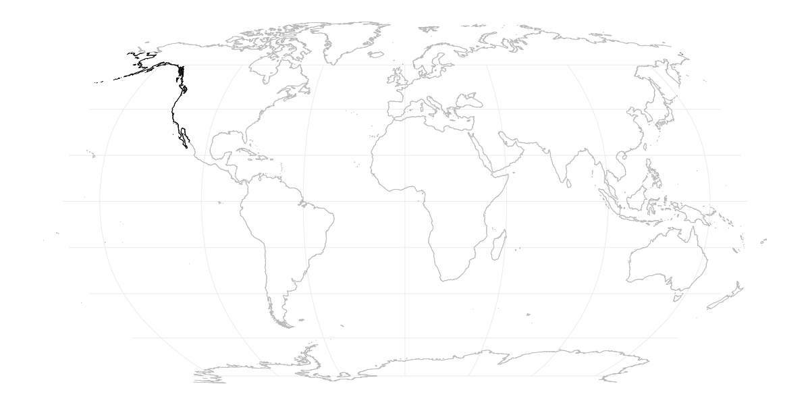

## Impact of oceanographic connectivity on the future distribution of marine species

Climate change is set to cause a major reshuffling of marine biodiversity, which can alter the structure of marine ecosystems and affect their performance and the benefits they deliver. Changes in the geographical distribution of marine species due to climate change are intricately linked to how ocean currents align with temperature gradients. This code explores how oceanographic connectivity may restrict a kelp species (Macrocystis pyrifera) to track suitable habitats under future climate change. It starts by loading habitat suitability maps for current and future distributions. The code then accesses the connectivity database to test if the species can disperse from its current range to the future areas. Finally, the code creates maps visualizing the kelp's current and future distributions and highlights the areas that might become disconnected due to dispersal barriers structured by ocean currents.

### Environment Preparation and Package Loading

Cleans the R environment and forces garbage collection to ensure a clean workspace. Loads necessary R packages for the analysis, which include coastalNet package.

```r 
# Clean environment and load packages
rm(list = ls())
gc(reset=TRUE)
library(coastalNet)
library(rnaturalearth)
library(viridis)
library(terra)
library(tidyterra)
library(gridExtra)
```

### Data Loading

Loading raster data representing the current and projected future distributions of Macrocystis pyrifera. This step involves removing non-relevant cells (with a value of 0) to focus on areas of presence.

```r 
# Download files from repository
download.file("https://figshare.com/ndownloader/files/47592260", "presentDay.tif", quiet = TRUE, mode = "wb")
download.file("https://figshare.com/ndownloader/files/47592257", "Future.tif", quiet = TRUE, mode = "wb")

# Load raster layers with the present-day and projected (future, year 2100) distributions of the marine species Macrocystis pyrifera.
presentDayRangeRaster <- rast("presentDay.tif")
futureRangeRaster <- rast("Future.tif")

# Remove cells of no present-day distribution
presentDayRangeRaster[presentDayRangeRaster == 0] <- NA
futureRangeRaster[futureRangeRaster == 0] <- NA

# Transform raster layers information to data.frame
presentDayRange <- crds(presentDayRangeRaster, na.rm=TRUE, df=TRUE)
futureRange <- crds(futureRangeRaster, na.rm=TRUE, df=TRUE)
```

### Connectivity Analysis

Loads the database of connectivity events (downloads also if not already present). Establish the study's spatial extent based on the range of Macrocystis pyrifera. It then identifies hexagon IDs representing both present-day locations and projected future sites, setting the stage for detailed connectivity analysis. Calculates oceanographic connectivity events within the defined study region, considering both present and future distributions. It assesses how well-connected present-day locations are with future potential habitats, using a 30-day period for event calculation.

```r 
# Load database
oceanographicConnectivity <- getDataBase(myFolder="Database", overwrite=FALSE)

# Get hexagon IDs that define the study region
combinedRange <- unique(rbind(presentDayRange,futureRange))
hexagonIDRegion <- getHexagonID(obj=combinedRange, level="extent", buffer=5, print=TRUE)
```



*Figure: Hexagon IDs (in black) defining the study region.*
<br>

```r 
# Get connectivity events for the study region (all years, all months, all days, 30 days period)
connectivityEvents <- getConnectivityEvents(connectivity=oceanographicConnectivity,hexagonID=hexagonIDRegion, period=30 )

# Get hexagon IDs of the sampling sites
hexagonIDSitesFrom <- getHexagonID(obj=presentDayRange, level="site", buffer=0, print=FALSE)
hexagonIDSitesTo <- getHexagonID(obj=futureRange, level="site", buffer=0, print=FALSE)

# Get pairwise connectivity estimates between coordinate sites
pairwiseConnectivity <- getPairwiseConnectivity(connectivityEvents, hexagonIDFrom=hexagonIDSitesFrom, hexagonIDTo=hexagonIDSitesTo, connType="Forward", value="Probability", steppingStone=FALSE)
```

### Pairwise Connectivity Estimates

Gets the connectivity matrix, which shows the probability of connectivity to future locations. It then identifies regions where the probability of connectivity is one and zero, indicating potential connected areas or dispersal barriers.

```r
# Find regions of probability zero
futureRangeConnected <- futureRange[which(apply(pairwiseConnectivity$connectivityMatrix,2,sum) != 0) ,]
futureRangeNotConnected <- futureRange[which(apply(pairwiseConnectivity$connectivityMatrix,2,sum) == 0),]
```

### Visualization of Results

The outcomes are visualized on a map, highlighting the present-day range, future range locations connected by oceanographic pathways, and those not connected.

```r
worldMap <- ne_countries(scale = "medium", returnclass = "sf")
worldMap <- st_crop(worldMap,presentDayRangeRaster)

plot1 <- ggplot() + 
  geom_sf(data = worldMap , fill="#CDCDCD", colour = "#9E9E9E" , size=0.25) +
  geom_point(data = presentDayRange, aes(x = x, y = y), colour = "#000000",size=2.5) +
  geom_point(data = presentDayRange, aes(x = x, y = y), colour = "#FFFFFF",size=1) +
  theme_minimal() + theme(axis.title.x=element_blank(),
                          axis.ticks.x=element_blank(),
                          axis.title.y=element_blank(),
                          axis.ticks.y=element_blank(), legend.position = "none") +
  coord_sf()

plot2 <- ggplot() + 
  geom_sf(data = worldMap , fill="#CDCDCD", colour = "#9E9E9E" , size=0.25) +
  geom_point(data = futureRange, aes(x = x, y = y), colour = "#000000",size=2.5) +
  geom_point(data = futureRange, aes(x = x, y = y), colour = "#FFFFFF",size=1) +
  theme_minimal() + theme(axis.title.x=element_blank(),
                          axis.ticks.x=element_blank(),
                          axis.title.y=element_blank(),
                          axis.ticks.y=element_blank(), legend.position = "none") +
  coord_sf()

plot3 <- ggplot() + 
  geom_sf(data = worldMap , fill="#CDCDCD", colour = "#9E9E9E" , size=0.25) +
  geom_point(data = futureRangeNotConnected, aes(x = x, y = y), colour = "#000000",size=2.5) +
  geom_point(data = futureRangeNotConnected, aes(x = x, y = y), colour = "red",size=1) +
  geom_point(data = futureRangeConnected, aes(x = x, y = y), colour = "#000000",size=2.5) +
  geom_point(data = futureRangeConnected, aes(x = x, y = y), colour = "#6067f3",size=1) +
  geom_point(data = presentDayRange, aes(x = x, y = y), colour = "#000000",size=2.5) +
  geom_point(data = presentDayRange, aes(x = x, y = y), colour = "#FFFFFF",size=1) +
  theme_minimal() + theme(axis.title.x=element_blank(),
                          axis.ticks.x=element_blank(),
                          axis.title.y=element_blank(),
                          axis.ticks.y=element_blank(), legend.position = "none") +
  coord_sf()

grid.arrange(plot1, plot2, plot3, ncol = 3)
```


*Figure: Future range expansions. White: Present range; Blue future range expansion; Red restricted future range expansion driven by oceanographic connectivity.*