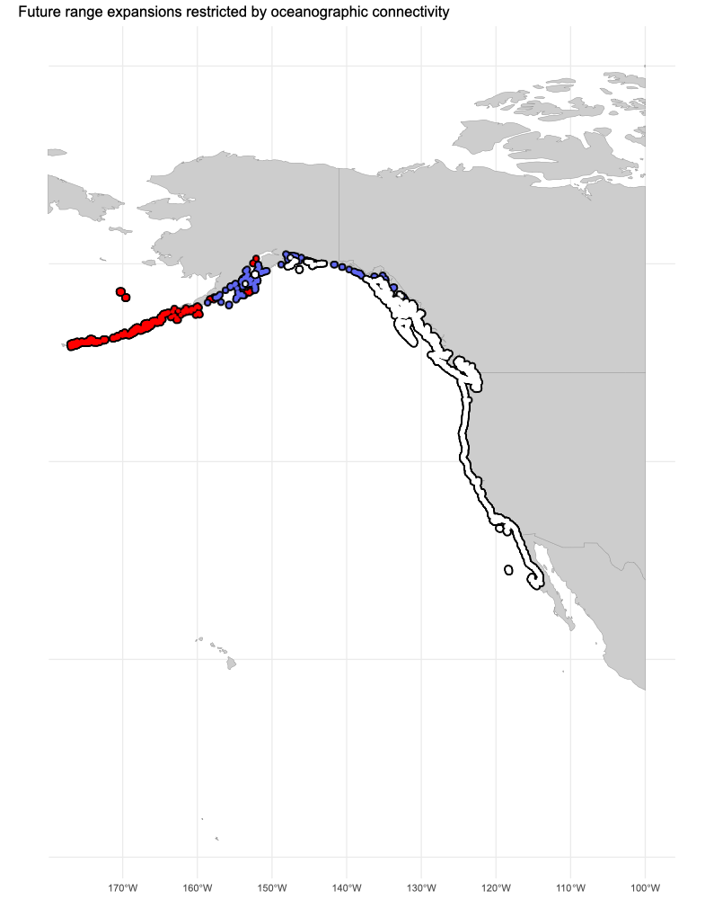

# Impact of oceanographic connectivity on the future distribution of marine species

This script focuses on evaluating the impact of oceanographic connectivity on the future distribution of the marine species Macrocystis pyrifera under changing environmental conditions. 

## Key Outcomes

A sophisticated approach to predicting future changes in marine species distributions, emphasizing the role of oceanographic connectivity. It combines spatial analysis, environmental modeling, and visualization techniques to address critical ecological and conservation questions, ultimately aiding in the development of informed marine management policies.

Here's a summary of the key steps and functionalities encapsulated in the code:

### Environment Preparation and Package Loading

Cleans the R environment and forces garbage collection to ensure a clean workspace. Loads necessary R packages for the analysis, which include coastalNet package, alongside with rnaturalearth for geographic data and viridis for color scales beneficial in mapping.

```r 
# Clean environment and load packages

rm(list = ls())
gc(reset=TRUE)
library(coastalNet)
library(rnaturalearth)
library(viridis)
library(tidyterra)
library(ggplot2)
library(sf)
sf_use_s2(FALSE)
```

### Data Loading

Loading and cleaning raster data representing the current and projected future distributions of Macrocystis pyrifera. This step involves removing non-relevant cells (with a value of 0) to focus on areas of actual presence.

```r 
# Load raster layers with the present-day and projected (future, year 2100) distributions of the marine species Macrocystis pyrifera.
presentDayRangeRaster <- rast("https://raw.githubusercontent.com/jorgeassis/coastalNet/main/vignettes/data/presentDay.tif")
futureRangeRaster <- rast("https://raw.githubusercontent.com/jorgeassis/coastalNet/main/vignettes/data/Future.tif")

# Remove cells of no present-day distribution
presentDayRangeRaster[presentDayRangeRaster == 0] <- NA
futureRangeRaster[futureRangeRaster == 0] <- NA

# Transform raster layers information to data.frame
presentDayRange <- crds(presentDayRangeRaster, na.rm=TRUE, df=TRUE)
futureRange <- crds(futureRangeRaster, na.rm=TRUE, df=TRUE)
```

### Connectivity Analysis

Initializes a local database for storing analysis results (if not already present). Establish the study's spatial extent based on the current range of Macrocystis pyrifera. It then identifies hexagon IDs representing both present-day locations and projected future sites, setting the stage for detailed connectivity analysis. Calculates oceanographic connectivity events within the defined study region, considering both present and future distributions. It assesses how well-connected present-day locations are with future potential habitats, using a 30-day period for event calculation.

```r 
# Load database
getDataBase(myFolder="Database", overwrite=FALSE)

# Get hexagon IDs that define the study region
hexagonIDRegion <- getHexagonID(obj=presentDayRange, level="extent", buffer=5, print=TRUE)

# Get connectivity events for the study region (all years, all months, all days, 30 days period)
connectivityEvents <- getConnectivityEvents(hexagonID=hexagonIDRegion, period=30 )

# Get hexagon IDs of the sampling sites
hexagonIDSitesFrom <- getHexagonID(obj=presentDayRange, level="site", buffer=0, print=FALSE)
hexagonIDSitesTo <- getHexagonID(obj=futureRange, level="site", buffer=0, print=FALSE)

# Get pairwise connectivity estimates between coordinate sites
pairwiseConnectivity <- getPairwiseConnectivity(connectivityEvents, hexagonIDFrom=hexagonIDSitesFrom, hexagonIDTo=hexagonIDSitesTo, connType="Forward", value="Probability", steppingStone=FALSE)
```

### Pairwise Connectivity Estimates

By comparing hexagon IDs of current and future ranges, the script estimates the likelihood of connectivity between sites. This step is crucial for understanding potential migration paths and barriers under future oceanographic conditions.

```r
# Find regions of probability zero
futureRangeConnected <- futureRange[which( hexagonIDSitesTo %in% pairwiseConnectivity$sitesConnected),]
futureRangeNotConnected <- futureRange[which( hexagonIDSitesTo %in% pairwiseConnectivity$sitesNotConnected),]
```

### Visualization of Results

The outcomes are visualized on a map, highlighting the present-day range, future range locations connected by oceanographic pathways, and those not connected. This visualization uses different colors to distinguish between currently occupied sites, future sites with potential connectivity, and future sites likely isolated due to lack of connectivity.

```r
worldMap <- ne_countries(scale = "medium", returnclass = "sf")[,1]
worldMap <- st_crop(worldMap,presentDayRangeRaster)

plot1 <- ggplot() + 
  geom_sf(data = worldMap , fill="#CDCDCD", colour = "#9E9E9E" , size=0.25) +
  geom_point(data = futureRangeNotConnected, aes(x = x, y = y), colour = "#000000",size=2.5) +
  geom_point(data = futureRangeNotConnected, aes(x = x, y = y), colour = "red",size=1) +
  geom_point(data = futureRangeConnected, aes(x = x, y = y), colour = "#000000",size=2.5) +
  geom_point(data = futureRangeConnected, aes(x = x, y = y), colour = "#6067f3",size=1) +
  geom_point(data = presentDayRange, aes(x = x, y = y), colour = "#000000",size=2.5) +
  geom_point(data = presentDayRange, aes(x = x, y = y), colour = "#FFFFFF",size=1) +
  theme_minimal() + theme(axis.title.x=element_blank(),
                          axis.ticks.x=element_blank(),
                          axis.title.y=element_blank(),
                          axis.ticks.y=element_blank(), legend.position = "none") +
  ggtitle("Future range expansions restricted by oceanographic connectivity")

plot1
```



*Future range expansions. While: Present range; Blue future range expansion; Red restricted future range expansion driven by oceanographic connectivity*